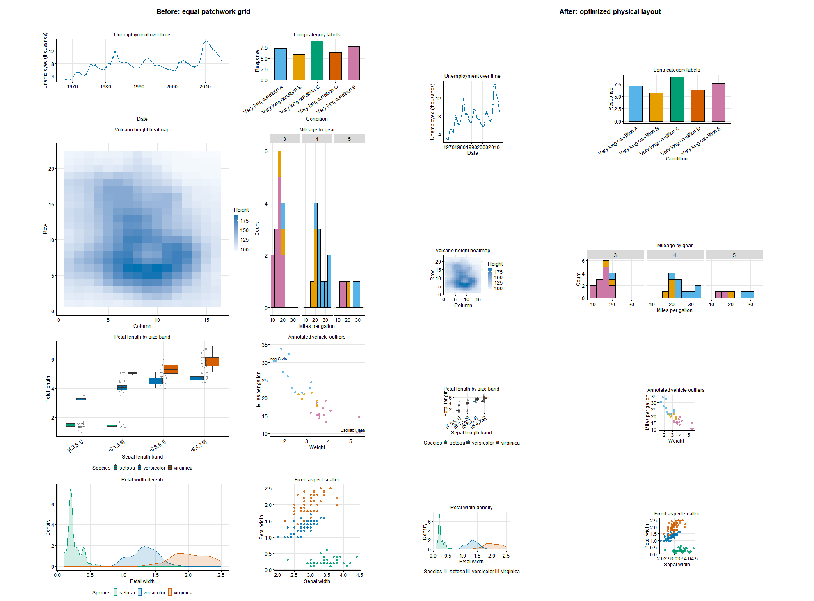

# plotfit

Automatic layout optimization for multi-plot ggplot PDF exports.

`plotfit` measures ggplot objects on a target-like PDF device, infers how much physical space each plot needs and returns suggested layouts for the 'patchwork' package, so that final plots have an ideal sizing.



## What It Does

- Accepts a list of `ggplot2` plots.
- Infers plot footprints automatically from axes, labels, aspect constraints.
- Chooses one or more pages.
- Suggests layouts for patchwork pacakge that results in sensible sizing of plots.
- Patchwork layout can be adjusted by user. 

## Installation

From a local checkout:

```r
install.packages("remotes")
remotes::install_local("D:/code/r/plotfit")
```

Or, from inside the project directory:

```r
remotes::install_local(".")
```

If the package is published on GitHub, install it with:

```r
remotes::install_github("jjfroehlich/plotfit")
```

For quick development without installing, source the files directly as shown
below.

## Basic Usage

Load the installed package:

```r
library(plotfit)
```

Source the package files during local development:

```r
for (r_file in sort(list.files("R", pattern = "\\.R$", full.names = TRUE))) {
  source(r_file)
}
```

Then optimize and inspect the suggested patchwork layout:

```r
layout_result <- suggest_patchwork_layout(
  plots = list(plot_a = p1, plot_b = p2, plot_c = p3),
  page_width_in = 8.27,
  page_height_in = 11.69
)

# Main artifacts for review, manual adjustment, and reuse:
layout_result$pages[[1]]$patchwork
cat(layout_result$pages[[1]]$patchwork_code)
```

## Faster and Constrained Searches

Use the fast preset for interactive iteration. Explicit limits still override
the preset defaults:

```r
quick_result <- suggest_patchwork_layout(plots, search_mode = "fast")
quick_result$performance_diagnostics$stages
quick_result$performance_diagnostics$candidates
quick_result$performance_diagnostics$fit_cache
```

For a narrative report, provide the complete page partition using plot names.
Singleton groups isolate a plot without supplying any physical dimensions:

```r
report_result <- suggest_patchwork_layout(
  plots,
  page_groups = list(c("overview", "trend"), "full_page_map", c("details", "appendix"))
)
```

Candidate search can also be bounded directly with
`search_timeout_seconds` and `early_stop_patience`. Timeouts are soft: an
in-progress candidate is allowed to finish.

## Patchwork vs Grid Output

`layout_engine = "patchwork"` is the preferred and default workflow when you
want an optimized layout that remains easy to inspect, copy, paste, and adjust
by hand. 

```r
layout_result <- suggest_patchwork_layout(plots)

# Draw or further customize the editable patchwork object.
layout_result$pages[[1]]$patchwork

# Copy/paste this generated code into your own script as a starting point.
cat(layout_result$pages[[1]]$patchwork_code)
```

`layout_engine = "grid"` is an optional exact preview and rendering aid. 

```r
layout_result <- suggest_patchwork_layout(plots, layout_engine = "grid")
pdf("optimized-preview.pdf", width = 8.27, height = 11.69)
draw_layout_pages(layout_result)
dev.off()
```

## Demo

Run the single demo script:

```powershell
& 'C:\Program Files\R\R-4.2.2\bin\Rscript.exe' scripts\demo.R
```

Default output:

- `demo_output/original_feedback.pdf`
- `demo_output/generalization_feedback.pdf`
- `demo_output/real_world_stress.pdf`
- `man/figures/readme-layout-comparison.png`

Run one scenario:

```powershell
& 'C:\Program Files\R\R-4.2.2\bin\Rscript.exe' scripts\demo.R --scenario=generalization
```

Write optional diagnostics, warnings, and generated patchwork code:

```powershell
& 'C:\Program Files\R\R-4.2.2\bin\Rscript.exe' scripts\demo.R --diagnostics
```

## Development

Run tests:

```powershell
& 'C:\Program Files\R\R-4.2.2\bin\Rscript.exe' -e "testthat::test_local('.', reporter = 'summary')"
```

Key invariants:

- No demo-specific plot IDs, titles, datasets, or positions may influence
  optimizer behavior.
- The demo script must pass ordinary ggplot objects, not plot-specific footprint
  overrides.
- Visual PDF review should use `layout_engine = "grid"`.